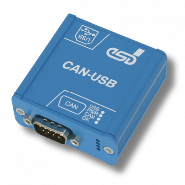
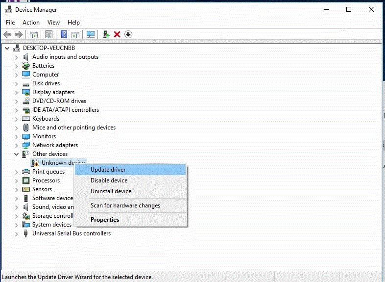
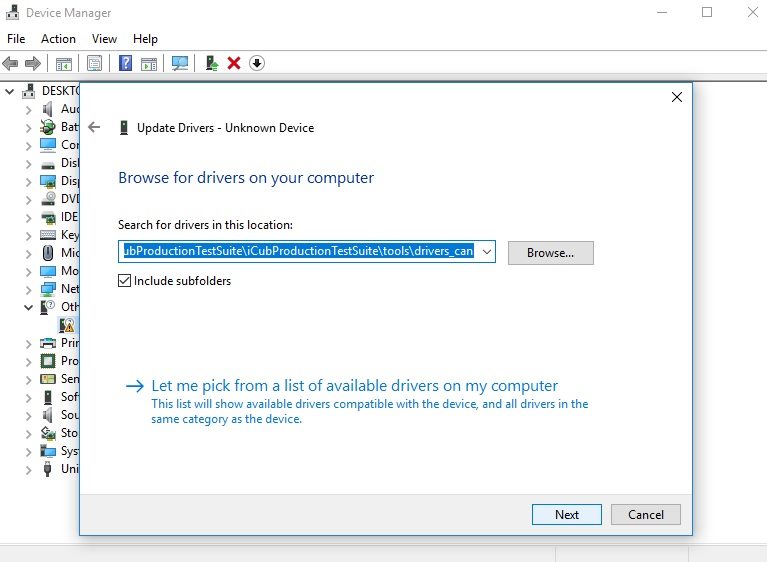
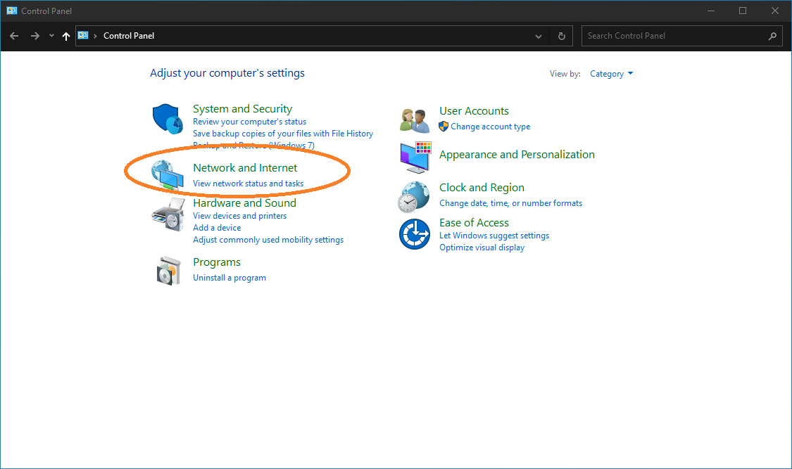
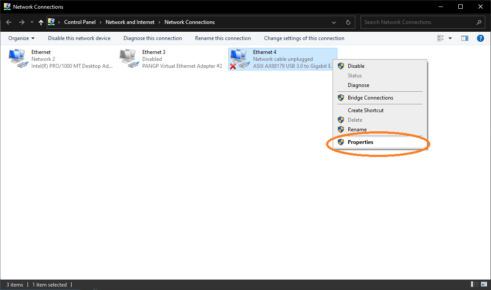
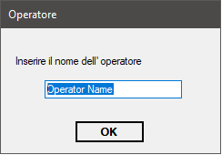
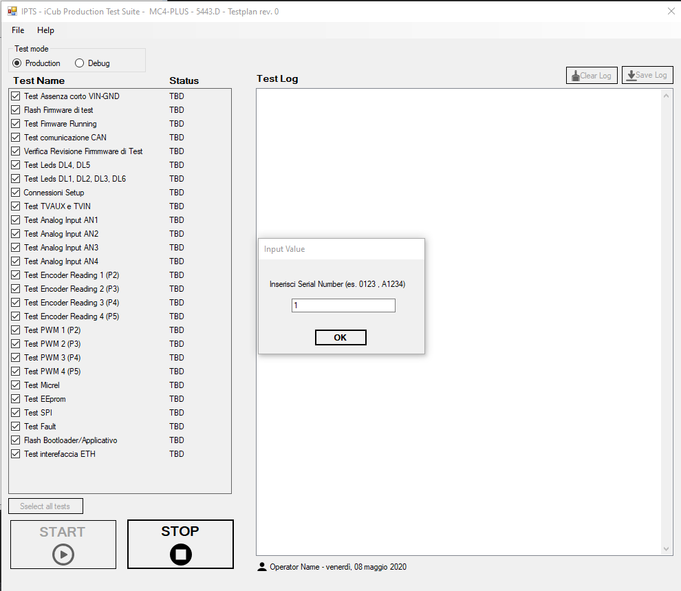
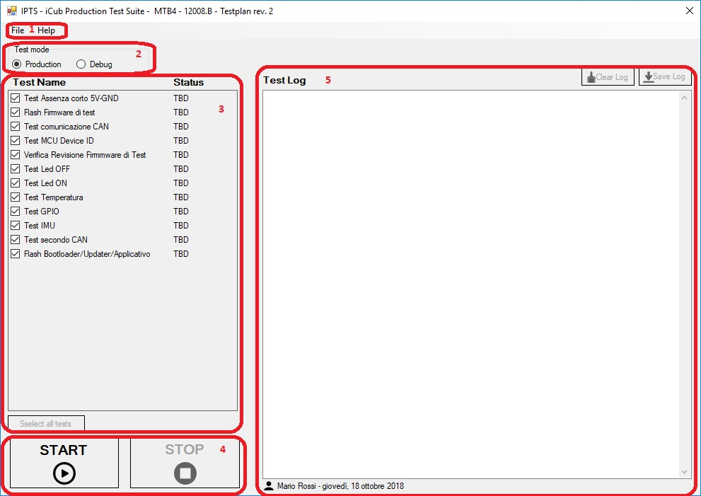
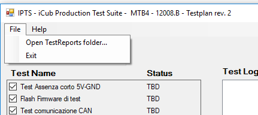

# IPTS - iCub Production Test Suite

IPTS is a test suite, configurable via .xml file, that allows to interact with test firmware loaded on boards to be tested.
Written in C# (.NET framework) , is a Windows Form application.
In this repo there are Visual Studio solution file, sources, and the installer project ([InnoSetup](https://jrsoftware.org/isinfo.php)) and output.

---

## 1 Installation

### 1.1 Installing the test suite

You can install **IPTS** on a Windows 10 machine.

- Download the [installer](https://github.com/icub-tech-iit/proto/tree/master/proto-utils/ipts-test-suite/iCubProductionTestSuite/Output)
- Run it and follow the wizard

### 1.2 Installing ESD CAN-USB drivers

`ESD CAN-USB` is an interface that allows to convert **USB** communications to **CAN** (and viceversa).
It is is used as communication interface between the test suite and the test firmware during the test.

- Connect the **ESD CAN-USB** and run Device manager
- Right click on the device -> update driver

- Choose “browse my computer for driver software” option

- Browse to ``[intallationPath]\tools\drivers_can`` (i.e. C:\Program Files (x86)\Istituto Italiano di Tecnologia\IPTS\tools\drivers_can) and correct drivers should be installed by Windows.

### 1.3 Configuring network interface

>This is necessary only for ETH boards (`mc4plus` and `mc2plus`).

To let `IPTS` testing the ethernet hardware we need to configure a network interface (also an `USB/ETH` adapter is good) with a fixed `ip address`.

Follow the steps below:

1. In `Control Panel` got to `Network and Internet`

2. Select `Network and Sharing Center` 

3. Select `Chnage adapter settings` 

4. Right click on the desired network interface then select `Properties`

5. Select `Internet Protocol Version 4 (TCP/IPv4)` then click on `Properties`

6. Select `Use the following IP address` and input the values as in figure below, then click `OK`

---

## 2 Run IPTS

- Launch the ``iCubProductionTestSuite.exe`` either from start menu, Desktop shortcut or installation folder

- Enter the full operator’s name

- Choose the board to be tested

- Click ``Run`` and enter the **serial number**, then follow the instructions given by the software

---

## 3 IPTS GUI description

This is the main GUI, here is a brief description of its functionalities

### 3.1 Toolbar

  - Under ``File`` you’ll find two options:

>
>- ``Open TestReports folder`` -> opens the folder containing all test reports
>- ``Exit`` -> quits the program

- Under ``Help`` youll’find About option that gives you info about software revision
  

### 3.2 Test mode

- ``Production`` mode
  >In this mode you can’t check/uncheck tests to be executed; you will execute the whole testplan. At the and a report will be generated under ``PASS`` or ``FAIL`` subfolder in ``TesteReports`` folder.

- ``Debug`` mode
  >In this mode you can check/uncheck tests to be executed; you will be able to choose which test or set of tests will be executed. At the and no report will be generated, anyway if you click on Save log the log will be saved under ``DEBUG`` subfolder in ``TesteReports`` folder.

### 3.3 Testplan
>Here’s the list of all tests to be executed to validate the DUT.
The list of tetss is defined in the ``ipts.xml`` file.
If Debug mode is selected you can execute one or more tests by checking them.

### 3.4 Run/Stop

- ``Run``
  >starts tests execution

- ``Stop``
  >stops tests execution

### 3.5 Log

> Here you can read the log of testplan execution.
Once tests execution is competed the report will be saved in the ``TestReports`` folder.
``Save log`` and ``Clear log`` buttons will be enabled only in debug mode.
At the bottom youll’find info about operator name and date.